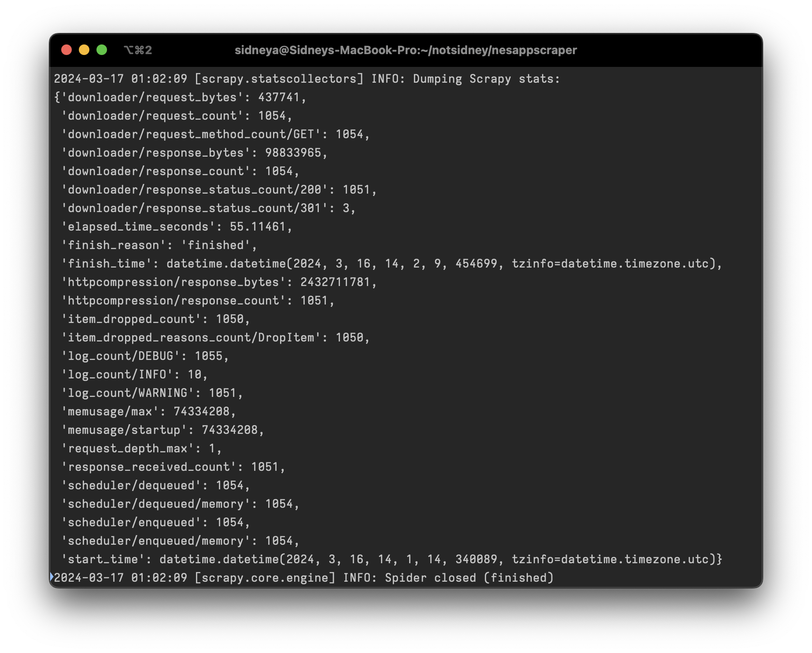

# NESA Past Papers Scraper

A web scraper for
[NESA HSC past paper links](http://educationstandards.nsw.edu.au/wps/portal/nesa/11-12/Understanding-the-curriculum/resources/hsc-exam-papers),
built with Scrapy on Python 2.7.14

This project is freely available under the [MIT Licence](https://github.com/notsidney/nesappscraper/blob/master/LICENSE).
Please link back to this repo! :)

This scraper was built to get links for all past paper documents for
http://hscpastpapers.com

<table>
<td>

**Contents**

- [Get the data](#get-the-data)
- [Data format](#data-format)
- [Running the scraper yourself](#running-the-scraper-yourself)
- [NESA HSC paper upload schedule](#nesa-hsc-paper-upload-schedule)
- [Acknowledgements](#acknowledgements)

</td>
</table>

## Get the data

### https://raw.githubusercontent.com/notsidney/nesappscraper/master/data.json

Check [`meta.json`](https://raw.githubusercontent.com/notsidney/nesappscraper/master/meta.json)
to see when `data.json` was last updated and how many items it scraped.

## Data format

Source of truth: [scripts/types.d.ts](./scripts/types.d.ts)

```ts
export type CourseItem = {
  course_name: string;
  packs: CoursePack[];
};

export type CoursePack = {
  year: string;
  link: string;
  docs: CourseDoc[];
};

export type CourseDoc = {
  doc_name: string;
  doc_link: string;
};
```

<details>
<summary><b>JSON Schema</b></summary>

Note: Each course_item is collapsed into one line.

```javascript
{
    "type": "array",
    "items": {
        "object": "course_item",
        "type": "object",
        "properties": {
            "course_name": { "type": "string" },
            "packs": {
                "type": "array",
                "items": {
                    "object": "exam_pack_item"
                    "type": "object",
                    "properties": {
                        "docs": {
                            "type": "array",
                            "items": {
                                "object": "doc_item",
                                "type": "object",
                                "properties": {
                                    "doc_name": { "type": "string" },
                                    "doc_link": { "type": "string" }
                                }
                            }
                        }
                        "link": { "type": "string" },
                        "year": { "type": "number" }
                    }
                }
            }
        }
    }
}
```

### Description

- The first level is an array of `course_item` objects.
- `course_item` is an object for each HSC course and each object contains:
  - `course_name`, a string containing the course name and
  - `packs`, an array of `exam_pack_item` objects.
- `exam_pack_item` is an object for each year there are documents available for
  each course. Each object contains:
  - `docs`, an array of `doc_item` objects,
  - `link`, a string containing the link to the exam pack, and
  - `year`, a number storing the year of the exam pack.
- `doc_item` is an object for each document within each exam pack. Each object
  contains:
  - `doc_name`, a string containing the name of the document and
  - `doc_link`, a string containing the link to the PDF document.

</details>

## Running the scraper yourself

The scraper currently uses the ScrapeOps proxy. You’ll need to get an API key by signing up at [scrapeops.io](https://scrapeops.io/)
and set the `SCRAPEOPS_API_KEY` environment variable with your API key.

```sh
pipenv run scrapy crawl nesapp
deno run --allow-read --allow-write scripts/merge.ts
```

The first command will write:

- `data_new.json`, the data you just scraped.

The second command will write:

- `data.json`, the data you just scraped merged with old data;
- `meta.json`, metadata including the scrape time; and
- `data_list.json`, the list of course items for improved Git diffs.

### Dependencies

- Python v3.11
- Pipenv v2023.10.24+
- Deno v1.37.2+

<details>
<summary>Install instructions</summary>

1. Download and install Python 3.11
   - macOS, using Homebrew: `brew install python`
   - Windows: https://www.python.org/downloads/
2. Download and install pipenv. Instructions:
   https://pipenv.pypa.io/en/latest/
3. Download and install Deno. Instructions:
   https://docs.deno.com/runtime/manual
4. Clone this repo or download ZIP using the green button above.
   - 
5. Open the directory of the cloned or downloaded repo.
6. Install Scrapy and other dependencies using pipenv, making sure it’s using
   Python 3.11: `pipenv install`

</details>

### Running on Scrapy Cloud

This version of the scraper will not work on Scrapy Cloud without modifications.
You need to switch the item pipeline in `settings.py`
(in the `nesappscraper` folder):

- Comment out line 69 by putting a `#` at the start of the line.
- Uncomment line 68 by removing the `#` at the start of the line.

### Changing output filename

In `pipelines.py` inside the `nesappscraper` folder:

- On line 16, change `data_new.json` to the file name you want.
- On line 18, change `meta.json` to the file name you want.
- The file extension must remain `.json`

### Runtime stats

On an M1 Max 16″ MacBook Pro with ~50 Mbps download connection:

- Runtime: ~1 min
- RAM usage: ~75 MB
- Total bytes sent: ~440 KB
- Total bytes received: ~100 MB
- Scrapy stats: 

On Scrapy Cloud with 1 unit, it ran for **~55 min**.

To check if your data is valid:

- Total request count should be **1661+** to get all papers.
- There should be **1654+** items scraped to get all papers.
- There should be **114** courses.

## NESA HSC paper upload schedule

This crawler should be loaded frequently during the HSC exam block to get the
latest papers. In 2017, papers are usually uploaded **two business days** after
the exam, around noon.

## Acknowledgements

- Scrapy: https://scrapy.org/
- All HSC papers are provided by NESA and owned by the State of New South Wales.
  They are protected by Crown copyright:
  http://educationstandards.nsw.edu.au/wps/portal/nesa/mini-footer/copyright
- This scraper does **not** store or make copies of the documents themselves.
  It only obtains the links to the official copies on the NESA website.
  It is intended for information purposes only.
